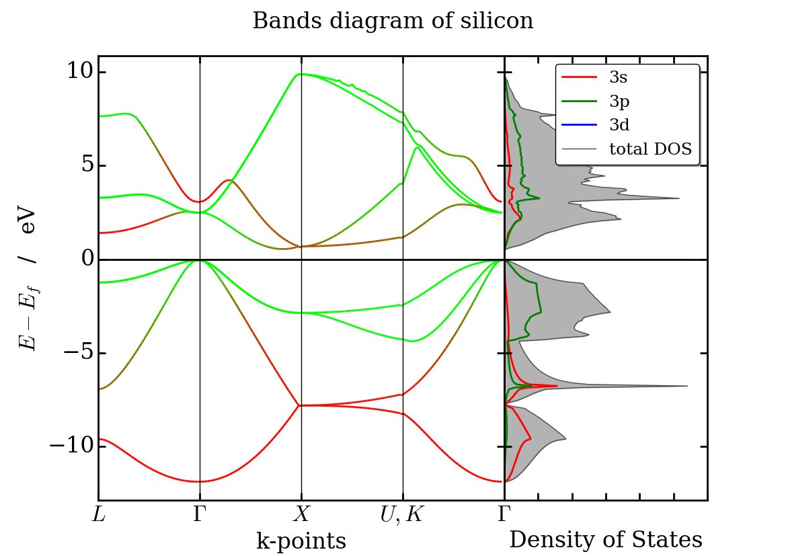

# Band Structure Plots

This repository contains several examples of band structure plots
using a rgb scale to look at atomic or orbital contributions. The plots are done
with [pymatgen](http://pymatgen.org/) and matplotlib. In order to use the
scripts on your own systems you have to read the band structure from your
calculations and to obtain a `pymatge.electronic_structure.bandstructure.BandStructure`
object.

## Examples

The reported examples are done using python3 and pymatgen version 3.6.0. The
band structure calculations were done with [VASP](http://www.vasp.at).

* copper : Cu_bands/
* silicon : Si_bands/
* graphene : graphene/

> The available band structure examples are not accurate calculations. The
> calculation were used in order to show the results of the code.
> You have to do your own calculculations, even if you are working on the same
> systems.

## More examples :

* [Silicon band structure with plotly](http://nbviewer.jupyter.org/github/gvallverdu/cookbook/blob/master/plotly_bandDiagram.ipynb)
* [MnO band structure with plotly](http://nbviewer.jupyter.org/github/gvallverdu/cookbook/blob/master/plotly_bandDiagram_SpinPolarized.ipynb)

## Questions, remarks, comments, bug reports

If you have any questions, remarks, comments, suggestions or if you find
any bug, please open an issue on this github repository.

## Licence

The code is delivered under the [MIT Licence](./LICENSE).
